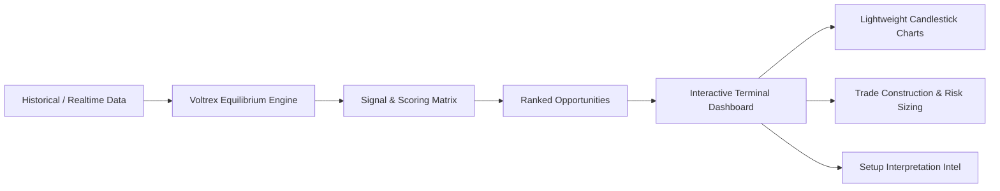
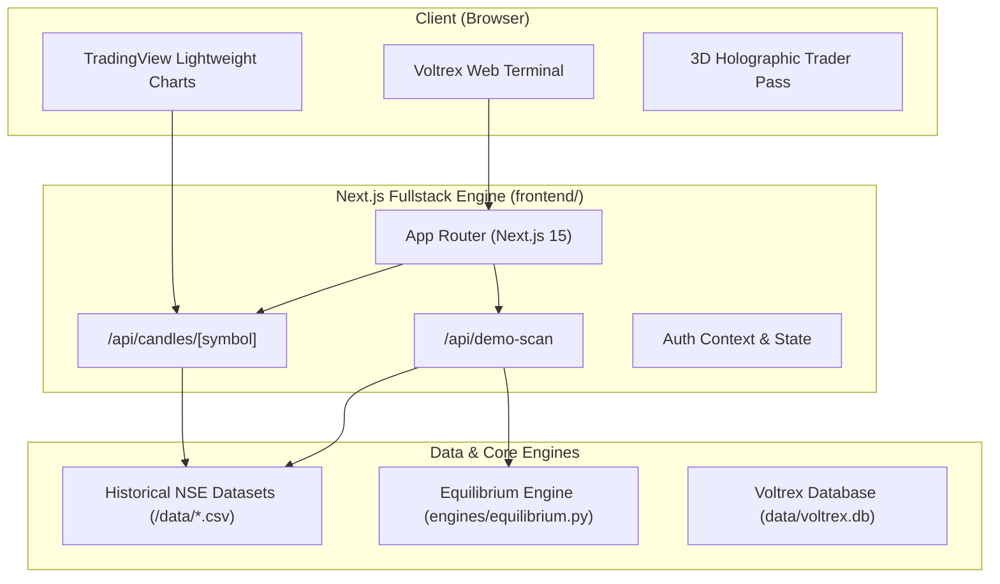

<div align="center">

# ⚡ VOLTREX TRADING SYSTEM

### *Institutional Market Structure & Harmonic Equilibrium Terminal*

[](https://nextjs.org/)
[](https://react.dev/)
[](https://www.typescriptlang.org/)
[](https://tailwindcss.com/)
[](https://www.tradingview.com/lightweight-charts/)
[](https://opensource.org/licenses/MIT)

<br/>

[✨ Live Demo](https://voltrex-trading-system.vercel.app/) • [📐 The Equilibrium Model](#-the-voltrex-equilibrium-engine) • [🏗️ System Architecture](#️-architecture) • [🔌 API Reference](#-api-routes) • [🚀 Setup Guide](#-installation--first-time-setup)

<br/>

```
  ╔═══════════════════════════════════════════════════════════════════════════╗
  ║  VOLTREX resolves institutional market structure into deterministic      ║
  ║  equilibrium levels, trend regime intelligence, and ranked opportunities. ║
  ╚═══════════════════════════════════════════════════════════════════════════╝
```

</div>

---

## 🧭 Overview

**Voltrex Trading System** is an institutional-grade swing-trading workstation and scanning terminal designed for Indian equities (NSE). 

At its core lies the proprietary **Square-Root Harmonic Equilibrium Engine**, which deterministically maps market liquidity zones, equilibrium True Value ($TV$), Quantitative Resistances ($QR_1$–$QR_3$), Quantitative Supports ($QS_1$–$QS_3$), dynamic volatility stops, and optimal risk-reward trade setups.



---

## 🌟 Key Features

<table>
  <tr>
    <td width="50%">
      <h3>🎯 Harmonic Equilibrium Engine</h3>
      <ul>
        <li>Deterministic pricing levels computed from square-root harmonics.</li>
        <li>Identifies <b>True Value (TV)</b> equilibrium pivot points.</li>
        <li>Calculates <b>QR1–QR3</b> resistance targets & <b>QS1–QS3</b> support levels.</li>
        <li>Automated dynamic Stop Loss (SL) and Risk/Reward (RR) metrics.</li>
      </ul>
    </td>
    <td width="50%">
      <h3>⚡ Multi-Symbol Signal Scanner</h3>
      <ul>
        <li>Real-time multi-stock ranking across high-volume NSE equities.</li>
        <li>Technical filters: RSI(14), ATR(14), Volume-to-20DMA Ratio.</li>
        <li>Regime detection: <b>BULL</b>, <b>BEAR</b>, <b>SIDEWAYS</b> market structure.</li>
        <li>Conviction Scoring (0–100) and Grading (Grade A to D).</li>
      </ul>
    </td>
  </tr>
  <tr>
    <td width="50%">
      <h3>📈 Interactive Candlestick Charting</h3>
      <ul>
        <li>Powered by <b>TradingView Lightweight Charts</b>.</li>
        <li>Overlay of live equilibrium levels ($QR, TV, QS, SL, LTP$).</li>
        <li>Instant ticker switching with historical price action.</li>
        <li>Zero external subscription dependencies — runs 100% locally.</li>
      </ul>
    </td>
    <td width="50%">
      <h3>🎛️ Institutional Trade Construction</h3>
      <ul>
        <li>Position sizing calculations based on capital and volatility.</li>
        <li>Dynamic risk allocation with Entry, Stop Loss, and Target levels.</li>
        <li>Quantitative trade thesis and setup interpretation notes.</li>
        <li>Dark & Light mode support with fluid CSS transition ripples.</li>
      </ul>
    </td>
  </tr>
</table>

---

## 📐 The Voltrex Equilibrium Engine

The Voltrex Engine computes canonical equilibrium pricing using discrete square-root harmonic transformations on asset price $P$:

$$\text{Rounded Base } (R) = \begin{cases} \text{round}(P / 100) \times 100 & \text{if } P \ge 40000 \\ \text{round}(P / 10) \times 10 & \text{if } P < 40000 \end{cases}$$

$$\text{Root } (\sigma) = \sqrt{R}, \quad S_1 = \lfloor \sigma \rfloor$$

$$S_2 = \begin{cases} S_1 + 2 & \text{if } R > S_1(S_1 + 1) \\ S_1 + 1 & \text{otherwise} \end{cases}$$

$$\text{True Value } (TV) = S_1 \times S_2$$

$$\text{Quantitative Resistances: } QR_n = S_1 \times (S_2 + 2n) \quad \text{for } n \in \{1, 2, 3\}$$

$$\text{Quantitative Supports: } QS_n = S_1 \times (S_2 - 2n) \quad \text{for } n \in \{1, 2, 3\}$$

---

## 🏗️ Architecture



---

## 📂 Project Structure

```text
Voltrex-Trading-System/
├── api/                        # FastAPI REST & WebSocket Backend
│   ├── auth.py                 # JWT authentication & password hashing
│   ├── config.py               # Voltrex configuration & environment bindings
│   ├── database.py             # Database persistence layer
│   └── main.py                 # FastAPI application routes
├── data/                       # NSE OHLCV historical dataset & local DB
│   ├── HDFCBANK.csv            # HDFC Bank historical candles
│   ├── ICICIBANK.csv           # ICICI Bank historical candles
│   ├── INFY.csv                # Infosys historical candles
│   ├── RELIANCE.csv            # Reliance Industries historical candles
│   ├── SBIN.csv                # State Bank of India historical candles
│   ├── TATASTEEL.csv           # Tata Steel historical candles
│   └── voltrex.db              # SQLite / local storage
├── engines/                    # Core mathematical engines
│   └── equilibrium.py          # Pure Voltrex Square-Root Harmonic logic
├── frontend/                   # Next.js 15 Terminal Application
│   ├── app/                    # Next.js App Router
│   │   ├── api/                # Next.js Route Handlers
│   │   │   ├── candles/[symbol]# OHLCV candle provider
│   │   │   └── demo-scan/      # Real-time scan generator
│   │   ├── alerts/             # Market alerts interface
│   │   ├── portfolio/          # Portfolio & trade journal analytics
│   │   ├── scanner/            # Full-page signal scanner
│   │   ├── watchlist/          # Custom watchlists
│   │   ├── globals.css         # Custom tokens & aesthetic design system
│   │   ├── layout.tsx          # Root layout with theme provider
│   │   └── page.tsx            # Main Terminal page
│   ├── components/             # React UI Components
│   │   ├── app-shell.tsx       # Collapsible navigation rail & status bar
│   │   ├── csv-chart.tsx       # Candlestick chart with equilibrium overlays
│   │   ├── terminal-dashboard.tsx # Main dashboard & trade construction
│   │   ├── trader-card.tsx     # 3D interactive holographic trader pass
│   │   └── ui.tsx              # Reusable UI primitives
│   ├── lib/                    # Utilities & Types
│   │   ├── api.ts              # API client & data fetchers
│   │   ├── types.ts            # TypeScript interfaces
│   │   └── utils.ts            # Formatting (INR, numbers)
│   └── package.json            # Frontend dependencies
├── scanners/                   # Technical indicator & scanning pipelines
├── scripts/                    # PowerShell automation & startup tools
├── requirements.txt            # Python dependencies
└── package.json                # Root proxy scripts
```

---

## 🚀 Installation & First-Time Setup

### Prerequisites

- **Node.js**: v18.18.0 or later (Node 20+ recommended)
- **npm** or **pnpm**
- *(Optional for Python backend)*: **Python 3.11+**

### 1. Clone the repository

```bash
git clone https://github.com/Devendraa500/Voltrex-Trading-System.git
cd Voltrex-Trading-System
```

### 2. Install dependencies

```bash
# Install frontend dependencies
cd frontend
npm install
cd ..
```

### 3. Launch Development Server

```bash
npm run dev
```

Open **[http://localhost:3000](http://localhost:3000)** in your browser.

---

## 🔌 API Routes

### Frontend Next.js Route Handlers

| Route | Method | Description |
| :--- | :---: | :--- |
| `/api/demo-scan` | `GET` | Generates a complete market scan of all tracked NSE symbols with calculated scores, grades, regimes, and equilibrium levels. |
| `/api/candles/[symbol]` | `GET` | Serves OHLCV historical candlestick data for any symbol (e.g. `/api/candles/RELIANCE`). |

### Optional Python FastAPI Backend (`/api`)

| Method | Route | Description |
| :---: | :--- | :--- |
| `GET` | `/api/v1/health` | Service health and engine status. |
| `GET` | `/api/v1/equilibrium/{price}` | Canonical Voltrex levels for any arbitrary price. |
| `POST` | `/api/v1/scanner/run` | Executes real multi-symbol scan. |
| `GET` | `/api/v1/scanner/latest` | Latest ranked scan snapshot. |
| `GET/POST` | `/api/v1/watchlists` | Persistent user watchlists. |
| `GET/POST` | `/api/v1/alerts` | Persistent price & signal alerts. |
| `GET/POST` | `/api/v1/trades` | Trade journal and analytics. |
| `WS` | `/ws/market` | Real-time WebSocket event stream. |

---

## 🛠️ Technology Stack

| Layer | Technology |
| :--- | :--- |
| **Framework** | [Next.js 15 (App Router)](https://nextjs.org/) |
| **UI Library** | [React 19](https://react.dev/) |
| **Styling** | [Tailwind CSS v4](https://tailwindcss.com/) + Custom Glassmorphic Design System |
| **Animations** | [Framer Motion 12](https://www.framer.com/motion/) |
| **Financial Charting** | [TradingView Lightweight Charts 5](https://www.tradingview.com/lightweight-charts/) |
| **3D Graphics** | [Three.js](https://threejs.org/) / [React Three Fiber](https://r3f.docs.pmnd.rs/) / [@react-three/drei](https://github.com/pmndrs/drei) |
| **Icons** | [Lucide React](https://lucide.dev/) |
| **Language** | [TypeScript 5](https://www.typescriptlang.org/) & [Python 3.12](https://www.python.org/) |

---

## 📄 License

Distributed under the **MIT License**. See [`LICENSE`](LICENSE) for more information.

---
